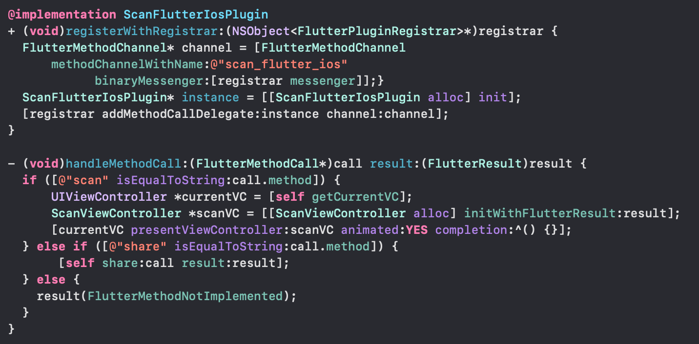
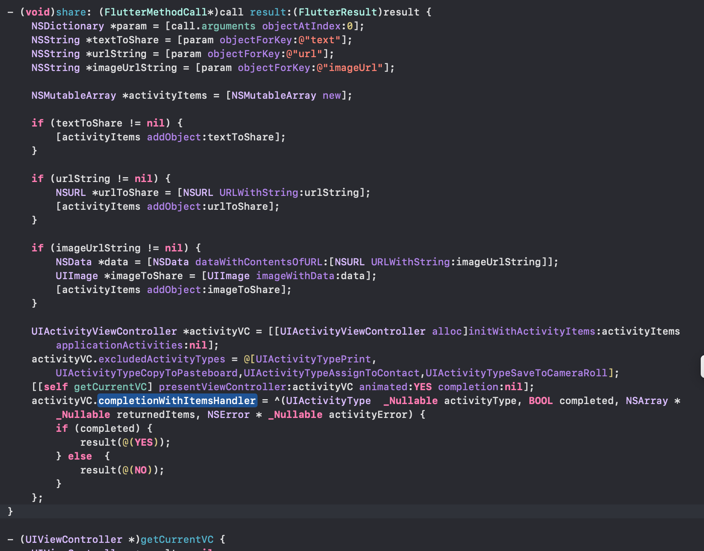
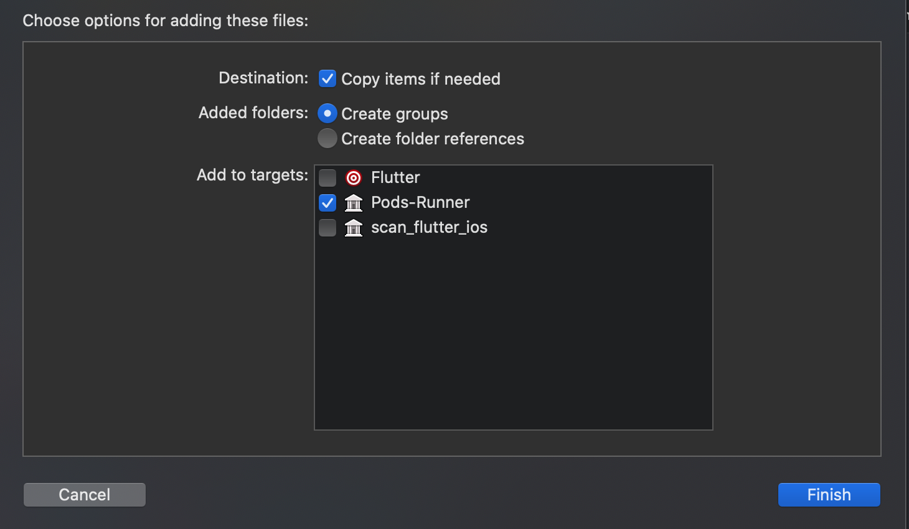
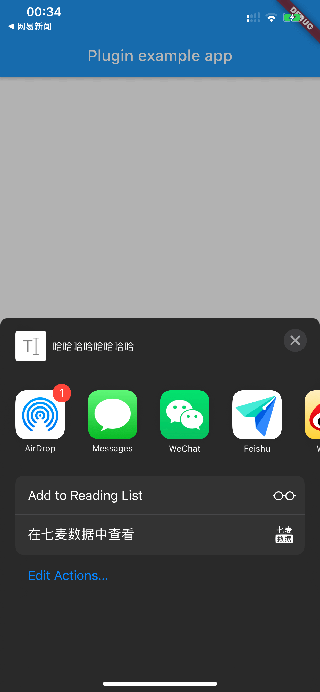

# scan_flutter_ios

## 怎么开发一个 flutter ios 插件

### 创建插件
Android Studio创建或者命令行创建:

```
flutter create -i objc --template=plugin scan_flutter_ios
```

现在看来默认是 swift，想要用 oc 的要加上 `-i objc`

### 编辑 iOS 工程代码

```
cd scan_flutter_ios/example
flutter build ios --no-codesign
```
build 会执行 pod install 等事情，执行完之后打开 `scan_flutter_ios/example/ios` 下的 Runner.xcworkspace(注意是那个白色的不是蓝色的)

然后打开 Pods -> Development Pods -> scan_flutter_ios -> ..(此处有好几层..) -> example -> ios -> .symlinks -> plugins -> scan_flutter_ios -> ios -> Classes

我们的插件代码在 Classes 文件夹下，这里其实是个映射，其实就是 `scan_flutter_ios/ios/Classes `下的文件，两边修改是一样的，只是在xcode里直接修改调试方便一点

默认会生成 ScanFlutterIosPlugin.h 和 ScanFlutterIosPlugin.m 文件

看 ScanFlutterIosPlugin.m



registerWithRegistrar 方法不用我们自己调用，里面的 channel 名 scan_flutter_ios 是与 dart 代码里一致的，不要刻意修改。
本例只用了 FlutterMethodChannel（其他还有MessageChannel和EventChannel），顾名思义调用方法。

handleMethodCall 是当 dart 调用 native 的时候执行，如果要 native 调用 dart 的方法或者发广播记得把 channel 对象挪出来给其他地方用。如 native 调 dart：`[channel invokeMethod:@"xx" arguments:@[@(666)]];`

call里面包含了 method 方法名和参数 arguments（id类型，可以认为是NSArray）。



FlutterResult是回调，执行 FlutterResult 会是 dart 里 Feature 的异步结果。
图中的 share 方法是唤起 iOS 的原生分享功能，在分享回调里执行 flutter 回调
图中的 scan 方法是创建native controller 扫码，并且把 FlutterResult 传过去方面扫码成功后回调扫码结果

#### 注意点

dart 与 native channel 通信的值类型是有限制的，具体看官网。明确的是 dart 不能传函数给 native，native 也不能传 block 给 dart，这不像 JSC 的 JSValue 那么自由。

在iOS工程里没使用 cocoapods，我目前没找到怎么很好的使用 cocoapods 的方法。因为在我的插件项目里使用的 cocoapods 装包，是能正确跑起来的，但是发布之后，别的项目装了我的包其实是只有 `ios/Classes` 目录下的我手写的代码，pods 依赖的库没有装，这让用户自己去 iOS 工程下装 pods 依赖好像也不怎么对。所以我目前是把所有代码都挪到了 classes 下，即使用到的别人的库也是直接源码挪进来，然后手动改各种依赖。



同上，因为无论是手写的还是导入的文件，我们的 target 都是要设置的 Pods-Runner，如果设置 Flutter 就没这情况了，但这只影响当前的 example，别人安装了还是跑不起来。所以当我们有一些资源比如图片的时候，就不能用 Assets 或者 bundle 文件了，因为不在 Build Phases -> Copy Bundle Resources 里，使用 `[NSBundle mainBundle] URLForResource` 读到的将会是 nil。除非要求使用这个库的人自己去在他们的xcode设置里加上，很不现实。所以我现在把扫码框的横条图片放到的线上，先从线上加载图片成 NSData 存本地，以后都从本地取。

上面两个问题由于才疏学浅不知道怎么搞，尤其是 cocoapods 不能用太坑了，直接规避了 iOS 生态一堆三方库，如果有大佬知道怎么玩，求指点。小弟邮箱: wayshon@qq.com

### 编辑 dart 代码

dart 代码在 `scan_flutter_ios/lib/scan_flutter_ios.dart`

主要是创建 channel，这里创建 channel 的字符串一定是要与native里面统一的，不要乱改。

定义一些调用 native 的方法，可以是 Feature，方便 await 等 native 调用 FlutterResult 返回。

_channel.invokeMethod 是调用 native 方法，_channel.setMethodCallHandler是可以注册被 native 调的方法

`scan_flutter_ios/example/lib/main.dart` 里是调用示例，调用 scan_flutter_ios 里的方法就行了

### 发布包

一行命令 `flutter packages pub publish`

复制命令行的url去浏览器登录 google

注意即使自己电脑有 socks 也要给终端设置一下，不然看看网页可以，终端还是没法接收到 google 的回调。参考文章 [Mac os配置Iterm2代理](http://www.hzy2m.com/2019/04/12/Mac-os-%E9%85%8D%E7%BD%AEIterm2%E4%BB%A3%E7%90%86/)

## Demo

使用扫码功能记得 xcode plist 加上相机相册的权限，Privacy - Camera Usage Description, Privacy - Photo Library Usage Description

[插件 pub 地址](https://pub.dev/packages/scan_flutter_ios)




